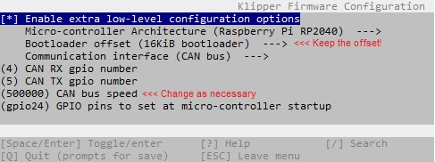

# Updating your SB2040 via CanBoot
  When I saw the dreaded "update" symbol in Mainsail next to Klipper, I knew it was time to hit up KIAUH. The problem is, I had just switched over to CAN Bus and that meant I had another MCU to update.
  Scouring the interwebs for clues as to how to accomplish this feat revealed that there really isn't a great write up on it.
  It's probably tribal knowledge throughout the Klipper community, but I just wasn't in the tribe.
  So, thanks to a bit of explaination from DonnerPlays on the 3DMellow section of the Voron Discord, the answer was revealed.
  Hopefully this helps someone in the future.
  
## The process
  The main process is pretty much the same as flashing Klipper after flashing CanBoot:
  1. SSH into your Pi
  2. Perform the following:
      * ```cd ~/klipper```
      * ```make clean```
      * ```make menuconfig```
      * You should have the following options for the SB2040 and CanBoot:
      
  3. Now do a ```make``` which will store klipper.bin in:
      * ```~/klipper/out/klipper.bin```
  4. Next, you're going to use ```flash_can.py``` to flash the firmware to the SB2040
      * ```cd ~/CanBoot/scripts```
      * ```python3 flash_can.py -i can0 -f ~/klipper/out/klipper.bin -u <uuid fingerprint>```

          + ` -i can0 ` is the can interface. If you named it differently, change that to match.
          + ` <uuid fingerprint> ` is the alphanumeric string you should have saved when setting up the SB2040 originally.
      * If you forgot your UUID, look here:
  
        https://github.com/cruiten/Voron-Related/blob/main/CANbus/Documentation/SB2040_CAN/install_configure_canboot.md
  
        It's a great page and an excellent resource for the initial setup of CanBoot and the SB2040.
  
  5. It should have flashed and you should be up and running again.
  
### Oh, and another thing...
  If you want to update your canbus speed, it's pretty simple.
  1. Do the above, but change the speed in make menuconfig to whatever you want.
  2. Flash to the SB2040.
      * Don't reboot or anything yet! It will cause errors and really upset Klipper, Moonraker, et. al.
  3. Change all your bitrates to the new speed:
  
      ` sudo nano /etc/network/interfaces.d/can0 `
       ```bash
       auto can0
       iface can0 can static
         bitrate <new bitrate>
         up ifconfig $IFACE txqueuelen 256
         pre-up ip link set can0 type can bitrate <new bitrate>
         pre-up ip link set can0 txqueuelen 256
       ```
4. Press <kbd>Ctrl</kbd>+<kbd>X</kbd> to save.
5. Reset the PI with: ` sudo reboot `
6. Enjoy your new CAN Bus speed.
